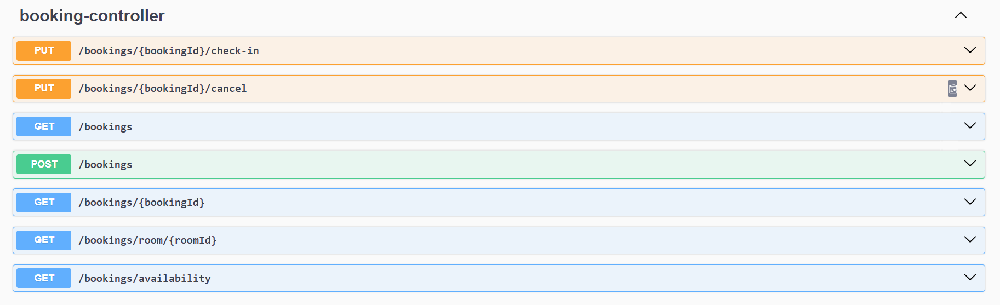

# Building a University Study Room Booking System using Domain-Driven Design and Spring Modulith

This repository contains a University Study Room Booking System built with:

- Java
- Spring Boot
- H2 (development database)
- Domain-Driven Design (bounded contexts, aggregates, value objects)
- Spring Modulith (explicit module boundaries + verification)
- jMolecules (layered structure inside each module)

This branch introduces a domain model refactor that removes tight coupling between booking workflows and the room catalog by separating operational state from time-based occupancy.

---

## Why this project exists

University study rooms are scarce. The failure modes are predictable:

- People book "just in case" and never show up (`NO_SHOW`)
- A few power users keep booking and block everyone (`HOARDING`)
- Staff end up being the enforcement layer (`MANUAL_POLICING`)
- Conflicts happen because the system cannot answer: who is allowed here right now (`DISPUTES`)

This project focuses on one enforcement mechanism: time-limited check-in.

If a student does not check in within the allowed grace period after the booking start, the booking becomes `NO_SHOW`, the room becomes available again for that timeslot, and the system remains consistent without staff intervention.

Business value in one sentence:
Increase room utilization without human interference.

---

## New business requirement

A room has two different kinds of state:

1. Operational state (admin-controlled, not time-based)
    - Example statuses: `ENABLED`, `DISABLED`
    - Managed by administrators
    - Must not be changed by booking flows

2. Time-based occupancy (derived from bookings)
    - A room is available or unavailable for a specific time range
    - Must be computed from booking data and booking lifecycle rules
    - Must not be stored on the room catalog entity

This requirement exists because "room status" is a real domain concept for admins (operational readiness) and should not be overloaded to represent time-based occupancy.

---

## The business problem (in plain terms)

1. Students book study rooms in fixed time increments
2. A booking is not valid unless the student checks in within the allowed check-in window
3. If check-in succeeds, the booking remains valid for the timeslot
4. If check-in fails (deadline passes), the booking becomes a no-show and the room becomes available again
5. Administrators manage the room catalog (add, remove, enable, disable rooms)
6. The system must prevent overlapping bookings and enforce booking state transitions correctly

Authentication and authorization are not implemented yet.

---

## Booking lifecycle (the rules engine)

A booking follows these statuses:

- `CONFIRMED`
- `CHECK_IN_REQUIRED`
- `CHECKED_IN`
- `COMPLETED`
- `CANCELLED`
- `NO_SHOW`

Example transitions:

- `CONFIRMED` -> `CHECK_IN_REQUIRED` at start time
- `CHECK_IN_REQUIRED` -> `CHECKED_IN` when check-in succeeds
- `CHECK_IN_REQUIRED` -> `NO_SHOW` when the check-in deadline passes
- `CHECKED_IN` -> `COMPLETED` when end time passes
- `CONFIRMED` -> `CANCELLED` before end time

Hard rules (examples):

- You cannot check in unless status is `CHECK_IN_REQUIRED`
- A booking becomes `NO_SHOW` only when the check-in deadline is reached
- Overlapping bookings must never result in two valid bookings for the same room and timeslot

---

## Old approach vs new approach

### Old approach (package boundaries only, room status overloaded)

The system used `Room.status = ACTIVE/INACTIVE` as a proxy for time-based occupancy.

Booking flows updated room status when bookings changed.

What this caused:

- Cross-module writes (booking code mutating room catalog state)
- Room status meant two different things depending on context:
    - admin readiness
    - time-based occupancy
- Harder testing because booking correctness depended on room write side effects
- Higher risk of future bugs when new requirements appear (maintenance mode, partial enablement, blackout windows)

### New approach (Spring Modulith modules, operational status separated from occupancy)

This branch makes a clear separation:

- The catalog module owns operational state
- The reservation module owns time-based occupancy and booking rules
- Reservation derives availability from booking data and operational status, without mutating the catalog

What this improves:

- No booking workflow writes into the catalog module
- Room operational state becomes stable and meaningful
- Booking availability becomes deterministic and testable
- Modules can evolve independently while staying in one deployable app

---

## What Spring Modulith is and why it helps here

Spring Modulith is a Spring project that helps you build modular monoliths with enforceable boundaries.

In a normal monolith, package boundaries are convention. Developers can still import anything from anywhere, and coupling grows silently.

Spring Modulith changes that by making modules explicit and verifiable:

- You structure code into application modules (often aligned with bounded contexts)
- You expose only a small public API per module
- You keep internals private (and Modulith will fail tests if other modules reach into them)
- You can build reliable domain event communication between modules
- You can verify module dependencies using tests

In this repository, Spring Modulith is used for two purposes:

1. Boundary enforcement
    - Prevents reservation from reaching into catalog internals
    - Prevents catalog from reaching into reservation internals
    - Keeps the modular monolith honest over time

2. Event-driven integration inside the monolith
    - Catalog publishes domain events when rooms are created, removed, enabled, disabled
    - Reservation listens to these events to update its local room cache
    - Enables eventual consistency without tight runtime coupling

Module verification test used in this repo:

```java
ApplicationModules.of(RoomBookingSystemApplication.class).verify();
```

## API Documentation(Swagger UI)
The API documentation is available at: http://localhost:8080/swagger-ui.html


